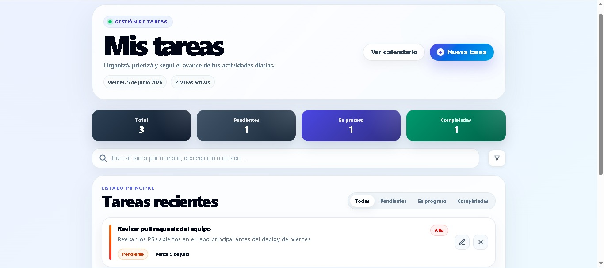
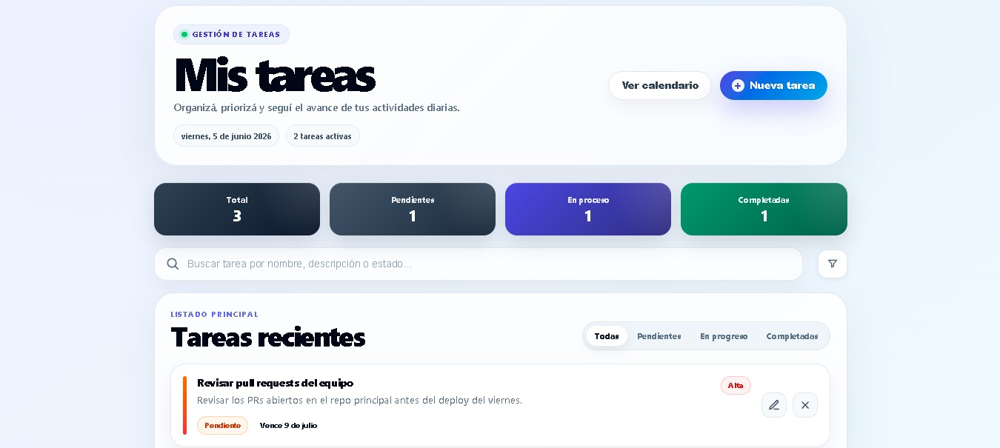
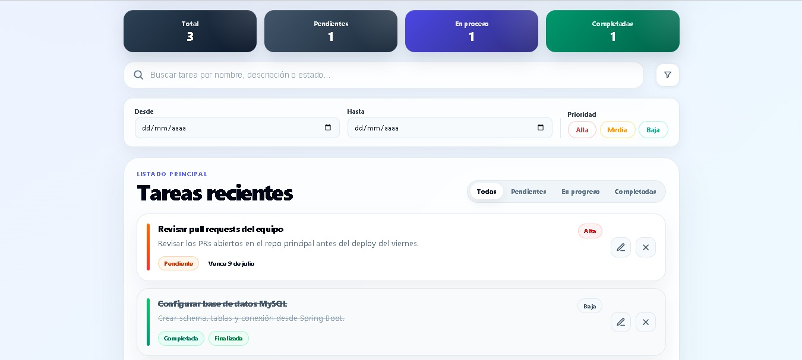
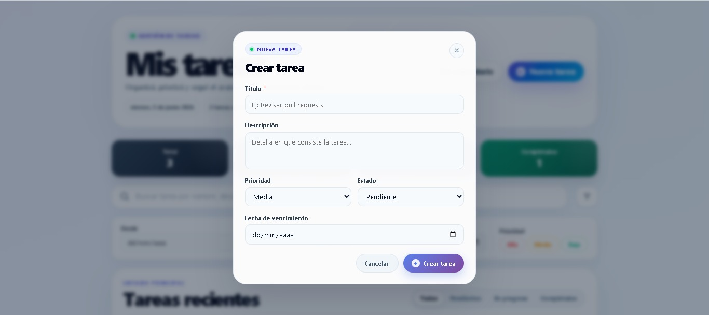
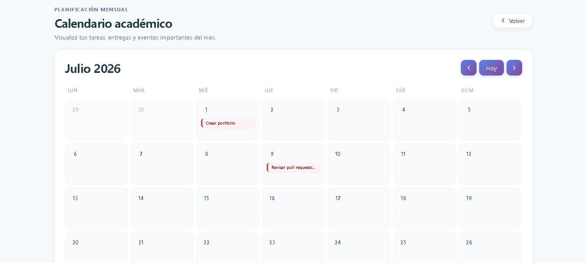

# TaskerApp

TaskerApp es una aplicación web full stack desarrollada como versión inicial para portfolio.

El objetivo del proyecto es demostrar la implementación de un flujo completo entre frontend, backend y base de datos, permitiendo gestionar tareas personales con persistencia real.

La aplicación permite crear, listar, editar, eliminar, completar, organizar y visualizar tareas, además de mostrarlas en un calendario según su fecha de vencimiento.

**Desarrollado por:** Pilar Cifuentes

---

## Objetivo del proyecto

El objetivo principal de TaskerApp es demostrar conocimientos prácticos de desarrollo full stack mediante una aplicación funcional que integra:

* Frontend desarrollado con Angular.
* Backend desarrollado con Java y Spring Boot.
* API REST.
* Persistencia de datos con MySQL.
* Arquitectura en capas.
* Validaciones básicas.
* Manejo centralizado de errores.
* Comunicación real entre frontend y backend.
* Visualización de tareas en dashboard y calendario.

---

## Funcionalidades principales

La aplicación permite:

* Crear nuevas tareas.
* Listar tareas en el dashboard principal.
* Editar tareas existentes.
* Eliminar tareas.
* Marcar tareas como en proceso.
* Marcar tareas como completadas.
* Visualizar la prioridad de cada tarea.
* Visualizar la fecha de vencimiento.
* Buscar tareas por nombre, descripción o estado.
* Filtrar tareas por prioridad.
* Filtrar tareas por fecha desde el frontend.
* Filtrar tareas por rango de fechas.
* Ver tareas dentro de una vista de calendario.
* Visualizar métricas generales de tareas: total, pendientes, en proceso y completadas.

---

## Vista previa de la aplicación

### Dashboard principal

Vista principal de TaskerApp, donde se visualiza el resumen general de tareas, cantidad total, tareas pendientes, tareas en proceso y tareas completadas.

<p align="center">
  
</p>

---

### Listado de tareas recientes

El dashboard muestra las tareas cargadas con información visual sobre estado, prioridad y fecha de vencimiento. Desde esta vista se puede editar o eliminar cada tarea.

<p align="center">
  
</p>

---

### Filtros de búsqueda, fecha y prioridad

La aplicación permite buscar tareas por texto, filtrar por prioridad y aplicar filtros por fecha desde el frontend.

<p align="center">
  
</p>

---

### Modal de creación de tarea

TaskerApp incluye un modal para crear nuevas tareas, permitiendo cargar título, descripción, prioridad, estado y fecha de vencimiento.

<p align="center">
  
</p>

---

### Vista calendario

La vista calendario permite visualizar las tareas distribuidas por fecha de vencimiento, facilitando la planificación mensual.

<p align="center">
  
</p>

---

## Stack tecnológico

### Backend

| Tecnología        | Versión / Detalle |
| ----------------- | ----------------- |
| Java              | 17                |
| Spring Boot       | 3.2.5             |
| Maven             | Maven Wrapper     |
| Spring Web        | API REST          |
| Spring Data JPA   | Persistencia      |
| Hibernate         | ORM               |
| MySQL             | 8.0.39            |
| Bean Validation   | Validaciones      |
| Lombok            | 1.18.32           |
| SpringDoc OpenAPI | Swagger UI        |

### Frontend

| Tecnología     | Versión / Detalle      |
| -------------- | ---------------------- |
| Angular        | 18.2.0                 |
| Angular CLI    | 18.2.0                 |
| TypeScript     | 5.5.2                  |
| Node.js        | 20.16.0                |
| npm            | 10.8.1                 |
| RxJS           | 7.8.0                  |
| Angular Router | Ruteo                  |
| Angular Forms  | Formularios            |
| CSS            | Estilos personalizados |

---

## Arquitectura general

TaskerApp está dividido en dos aplicaciones principales:

```txt
TaskerApp
├── taskerApp
├── taskerApp_frontend
└── docs
    └── images
```

| Carpeta              | Descripción                                 |
| -------------------- | ------------------------------------------- |
| `taskerApp`          | Backend desarrollado con Java y Spring Boot |
| `taskerApp_frontend` | Frontend desarrollado con Angular           |
| `docs/images`        | Imágenes utilizadas en el README            |

---

## Backend

El backend expone una API REST para gestionar tareas.

Está desarrollado con una arquitectura en capas, separando responsabilidades entre controladores, servicios, repositorios, DTOs, entidades y manejo de excepciones.

### Estructura principal del backend

```txt
taskerApp
├── src
│   └── main
│       ├── java
│       │   └── com.tasker.taskerApp
│       │       ├── configs
│       │       │   └── CorsConfig
│       │       ├── controllers
│       │       │   └── TaskController
│       │       ├── DTOs
│       │       │   ├── TaskRequestDTO
│       │       │   └── TaskResponseDTO
│       │       ├── entities
│       │       │   ├── enums
│       │       │   │   ├── TaskPriority
│       │       │   │   └── TaskStatus
│       │       │   └── TaskEntity
│       │       ├── exceptions
│       │       │   ├── ErrorResponse
│       │       │   ├── GlobalExceptionHandler
│       │       │   └── ResourceNotFoundException
│       │       ├── repositories
│       │       │   └── TaskRepository
│       │       ├── services
│       │       │   ├── implementations
│       │       │   │   └── TaskServiceImpl
│       │       │   └── TaskService
│       │       └── TaskerAppApplication
│       └── resources
│           └── application.properties
├── pom.xml
├── mvnw
└── mvnw.cmd
```

### Capas del backend

| Capa         | Responsabilidad                                     |
| ------------ | --------------------------------------------------- |
| `Controller` | Expone los endpoints REST                           |
| `Service`    | Contiene la lógica de negocio                       |
| `Repository` | Gestiona el acceso a datos mediante Spring Data JPA |
| `DTOs`       | Define los objetos de entrada y salida de la API    |
| `Entity`     | Representa la tabla `tasks` en la base de datos     |
| `Exceptions` | Centraliza el manejo de errores                     |
| `Configs`    | Contiene configuraciones generales como CORS        |

---

## Configuración del backend

El backend utiliza MySQL como base de datos.

Archivo:

```txt
src/main/resources/application.properties
```

Configuración base:

```properties
spring.application.name=taskerApp

spring.datasource.url=jdbc:mysql://localhost:3306/tasker_db
spring.datasource.username=root
spring.datasource.password=tu_password
spring.datasource.driver-class-name=com.mysql.cj.jdbc.Driver

spring.jpa.hibernate.ddl-auto=update
spring.jpa.show-sql=true

springdoc.swagger-ui.path=/swagger-ui.html
```

La configuración corresponde a un entorno local de desarrollo.

Cada usuario debe reemplazar las credenciales de MySQL según su instalación.

---

## Base de datos

### Nombre de la base de datos

```sql
tasker_db
```

### Tabla principal

```sql
tasks
```

### Modelo de datos

| Campo         | Tipo           | Descripción                         |
| ------------- | -------------- | ----------------------------------- |
| `id`          | INT            | Identificador único autoincremental |
| `title`       | VARCHAR(150)   | Título obligatorio de la tarea      |
| `description` | VARCHAR(500)   | Descripción opcional                |
| `status`      | VARCHAR / ENUM | Estado actual de la tarea           |
| `priority`    | VARCHAR / ENUM | Prioridad asignada                  |
| `created_at`  | DATETIME       | Fecha automática de creación        |
| `updated_at`  | DATETIME       | Fecha de última actualización       |
| `due_date`    | DATETIME       | Fecha límite o vencimiento          |

---

## Estados de tarea

```java
public enum TaskStatus {
    PENDING,
    IN_PROGRESS,
    COMPLETED
}
```

| Estado        | Descripción      |
| ------------- | ---------------- |
| `PENDING`     | Tarea pendiente  |
| `IN_PROGRESS` | Tarea en proceso |
| `COMPLETED`   | Tarea completada |

---

## Prioridades de tarea

```java
public enum TaskPriority {
    LOW,
    MEDIUM,
    HIGH
}
```

| Prioridad | Descripción     |
| --------- | --------------- |
| `LOW`     | Prioridad baja  |
| `MEDIUM`  | Prioridad media |
| `HIGH`    | Prioridad alta  |

---

## API REST

La API se expone desde:

```txt
http://localhost:8080
```

Ruta base de tareas:

```txt
/tasks
```

### Endpoints disponibles

| Método   | Endpoint                 | Descripción                           |
| -------- | ------------------------ | ------------------------------------- |
| `POST`   | `/tasks`                 | Crear una nueva tarea                 |
| `GET`    | `/tasks`                 | Obtener todas las tareas              |
| `GET`    | `/tasks/{id}`            | Obtener una tarea por ID              |
| `PUT`    | `/tasks/{id}`            | Actualizar una tarea existente        |
| `PATCH`  | `/tasks/{id}/in_process` | Cambiar una tarea a estado en proceso |
| `PATCH`  | `/tasks/{id}/complete`   | Marcar una tarea como completada      |
| `DELETE` | `/tasks/{id}`            | Eliminar una tarea                    |
| `GET`    | `/tasks/status/{status}` | Filtrar tareas por estado             |

---

## Ejemplo de request

### Crear tarea

```http
POST /tasks
```

Body:

```json
{
  "title": "Estudiar Angular",
  "description": "Repasar componentes, servicios y routing",
  "status": "PENDING",
  "priority": "HIGH",
  "dueDate": "2026-06-15T18:00:00"
}
```

---

## Ejemplo de response

```json
{
  "id": 1,
  "title": "Estudiar Angular",
  "description": "Repasar componentes, servicios y routing",
  "status": "PENDING",
  "priority": "HIGH",
  "createdAt": "2026-06-09T20:15:30",
  "updatedAt": null,
  "dueDate": "2026-06-15T18:00:00"
}
```

---

## Validaciones

El backend implementa validaciones básicas sobre los datos recibidos.

### TaskRequestDTO

| Campo         | Validación                                            |
| ------------- | ----------------------------------------------------- |
| `title`       | Obligatorio                                           |
| `title`       | Máximo 150 caracteres                                 |
| `description` | Máximo 500 caracteres                                 |
| `priority`    | Debe corresponder a un valor válido de `TaskPriority` |
| `status`      | Debe corresponder a un valor válido de `TaskStatus`   |
| `dueDate`     | Opcional                                              |

---

## Reglas de negocio

Al crear una tarea:

* Si no se envía un estado, el sistema asigna `PENDING`.
* Si no se envía una prioridad, el sistema asigna `MEDIUM`.
* La fecha de creación se genera automáticamente.
* La fecha de actualización se modifica cuando una tarea es editada o cambia de estado.

Al modificar una tarea:

* Se actualizan únicamente los campos enviados.
* Se registra la fecha de última actualización.

Al cambiar estado:

* Una tarea puede pasar a `IN_PROGRESS`.
* Una tarea puede pasar a `COMPLETED`.
* Si una tarea ya está completada, no se modifica nuevamente.

---

## Manejo de errores

El backend implementa manejo centralizado de errores mediante `@ControllerAdvice`.

Actualmente se controla el caso de recursos no encontrados utilizando una excepción personalizada:

```java
ResourceNotFoundException
```

### Formato de error

```json
{
  "status": 404,
  "error": "Not Found",
  "message": "Task no encontrada con id: 1"
}
```

---

## Documentación Swagger

El backend incluye documentación interactiva mediante SpringDoc OpenAPI.

Una vez iniciado el backend, se puede acceder desde:

```txt
http://localhost:8080/swagger-ui.html
```

---

## Configuración CORS

El backend incluye una clase `CorsConfig` para permitir la comunicación entre Angular y Spring Boot durante el desarrollo local.

Configuración recomendada:

```java
registry.addMapping("/**")
        .allowedOrigins("http://localhost:4200")
        .allowedMethods("GET", "POST", "PUT", "PATCH", "DELETE")
        .allowedHeaders("*");
```

---

## Frontend

El frontend está desarrollado con Angular 18 y consume la API REST del backend mediante un servicio HTTP centralizado.

La aplicación permite gestionar tareas desde una interfaz web simple y funcional.

### Estructura principal del frontend

```txt
taskerApp_frontend
├── public
├── src
│   ├── app
│   │   ├── core
│   │   │   ├── interceptors
│   │   │   ├── models
│   │   │   └── services
│   │   │       └── task.service.ts
│   │   ├── features
│   │   │   ├── components
│   │   │   ├── dashboard
│   │   │   └── pages
│   │   ├── shared
│   │   ├── app.component.css
│   │   ├── app.component.html
│   │   ├── app.component.ts
│   │   ├── app.config.ts
│   │   └── app.routes.ts
│   ├── environments
│   │   └── environment.ts
│   ├── index.html
│   ├── main.ts
│   └── styles.css
├── package.json
└── angular.json
```

### Organización del frontend

| Carpeta        | Descripción                                             |
| -------------- | ------------------------------------------------------- |
| `core`         | Contiene modelos, servicios HTTP e interceptores        |
| `features`     | Contiene componentes funcionales de la aplicación       |
| `pages`        | Contiene vistas principales como dashboard y calendario |
| `shared`       | Recursos compartidos reutilizables                      |
| `environments` | Variables de entorno, incluyendo la URL del backend     |

---

## Configuración de entorno frontend

Archivo:

```txt
src/environments/environment.ts
```

Configuración:

```ts
export const environment = {
  production: false,
  urlHost: 'http://localhost:8080',
};
```

El servicio de tareas consume la API desde:

```txt
http://localhost:8080/tasks
```

---

## Servicio Angular

El frontend utiliza un servicio centralizado llamado `TaskService`, encargado de comunicarse con el backend.

### Métodos principales

| Método Angular        | Endpoint                       | Descripción                    |
| --------------------- | ------------------------------ | ------------------------------ |
| `getAll()`            | `GET /tasks`                   | Obtiene todas las tareas       |
| `getById(id)`         | `GET /tasks/{id}`              | Obtiene una tarea por ID       |
| `create(task)`        | `POST /tasks`                  | Crea una tarea                 |
| `update(id, task)`    | `PUT /tasks/{id}`              | Actualiza una tarea            |
| `markAsInProcess(id)` | `PATCH /tasks/{id}/in_process` | Cambia la tarea a en proceso   |
| `markAsComplete(id)`  | `PATCH /tasks/{id}/complete`   | Marca la tarea como completada |
| `delete(id)`          | `DELETE /tasks/{id}`           | Elimina una tarea              |
| `getByStatus(status)` | `GET /tasks/status/{status}`   | Filtra tareas por estado       |

---

## Modelo frontend

```ts
export interface Task {
  id?: number;
  title: string;
  description?: string;
  status: TaskStatus;
  priority: TaskPriority;
  createdAt?: string;
  updatedAt?: string;
  dueDate?: string;
}
```

### Enum de prioridad

```ts
export enum TaskPriority {
  HIGH = 'HIGH',
  MEDIUM = 'MEDIUM',
  LOW = 'LOW',
}
```

### Enum de estado

```ts
export enum TaskStatus {
  PENDING = 'PENDING',
  IN_PROGRESS = 'IN_PROGRESS',
  COMPLETED = 'COMPLETED'
}
```

---

## Rutas del frontend

| Ruta         | Descripción                                                                   |
| ------------ | ----------------------------------------------------------------------------- |
| `/dashboard` | Vista principal para listar, crear, editar, eliminar, buscar y filtrar tareas |
| `/calendar`  | Vista calendario donde se muestran tareas según su fecha de vencimiento       |

La ruta raíz redirige automáticamente a:

```txt
/dashboard
```

---

## Filtros del frontend

El dashboard incluye herramientas de filtrado para mejorar la gestión visual de tareas.

Filtros disponibles:

* Búsqueda por nombre.
* Búsqueda por descripción.
* Búsqueda por estado.
* Filtro por prioridad.
* Filtro por fecha desde.
* Filtro por fecha hasta.
* Filtro por rango de fechas.

Estos filtros permiten encontrar tareas específicas sin modificar la información persistida en la base de datos.

---

## Configuración standalone de Angular

La aplicación utiliza configuración standalone de Angular mediante `app.config.ts`.

Se configuran:

* Rutas con `provideRouter(routes)`.
* Cliente HTTP con `provideHttpClient()`.
* Optimización de detección de cambios con `provideZoneChangeDetection`.

---

## Instalación y ejecución

### Requisitos previos

Antes de ejecutar el proyecto, es necesario tener instalado:

* Java 17.
* Node.js 20.16.0 o compatible.
* npm 10.8.1 o compatible.
* MySQL 8.0.39 o compatible.

---

## Configurar la base de datos

Crear una base de datos en MySQL:

```sql
CREATE DATABASE tasker_db;
```

Luego verificar las credenciales en:

```txt
taskerApp/src/main/resources/application.properties
```

---

## Ejecutar backend

Desde la carpeta raíz del proyecto:

```bash
cd taskerApp
```

En Windows:

```bash
.\mvnw.cmd spring-boot:run
```

En Linux/Mac:

```bash
./mvnw spring-boot:run
```

El backend queda disponible en:

```txt
http://localhost:8080
```

Swagger queda disponible en:

```txt
http://localhost:8080/swagger-ui.html
```

---

## Ejecutar frontend

Desde la carpeta raíz del proyecto:

```bash
cd taskerApp_frontend
```

Instalar dependencias:

```bash
npm install
```

Ejecutar la aplicación:

```bash
npm start
```

También puede ejecutarse con:

```bash
ng serve
```

El frontend queda disponible en:

```txt
http://localhost:4200
```

---

## Flujo general de uso

1. El usuario ingresa al dashboard.
2. El frontend solicita las tareas al backend.
3. El backend consulta la base de datos MySQL.
4. Las tareas se muestran en pantalla.
5. El usuario puede crear, editar, eliminar o cambiar el estado de una tarea.
6. El usuario puede buscar y filtrar tareas por texto, prioridad o fecha.
7. Cada operación de escritura se envía al backend mediante HTTP.
8. El backend persiste los cambios en MySQL.
9. El calendario muestra visualmente las tareas según su fecha de vencimiento.

---

## Alcance actual

Esta versión inicial incluye:

* CRUD completo de tareas.
* Backend REST con Spring Boot.
* Persistencia con MySQL.
* Frontend Angular conectado al backend.
* Dashboard de tareas.
* Modal de creación y edición.
* Búsqueda por nombre, descripción o estado.
* Filtro por prioridad.
* Filtro por fecha desde el frontend.
* Filtro por rango de fechas.
* Cambio de estado desde edición.
* Calendario visual de tareas.
* Manejo básico de errores.
* Documentación Swagger.

---

## Mejoras futuras

Posibles mejoras para próximas versiones:

* Agregar autenticación de usuarios.
* Implementar login y registro.
* Asociar tareas a usuarios.
* Agregar categorías o etiquetas.
* Mejorar el filtro por estado desde el frontend.
* Agregar paginación.
* Agregar ordenamiento por fecha o prioridad.
* Mejorar manejo de errores de validación.
* Agregar tests unitarios y de integración.
* Preparar configuración para despliegue.
* Agregar Docker para backend, frontend y base de datos.

---

## Estado del proyecto

TaskerApp se encuentra en una versión inicial funcional, desarrollada como proyecto de portfolio para demostrar conocimientos de desarrollo full stack con Angular, Java, Spring Boot y MySQL.
